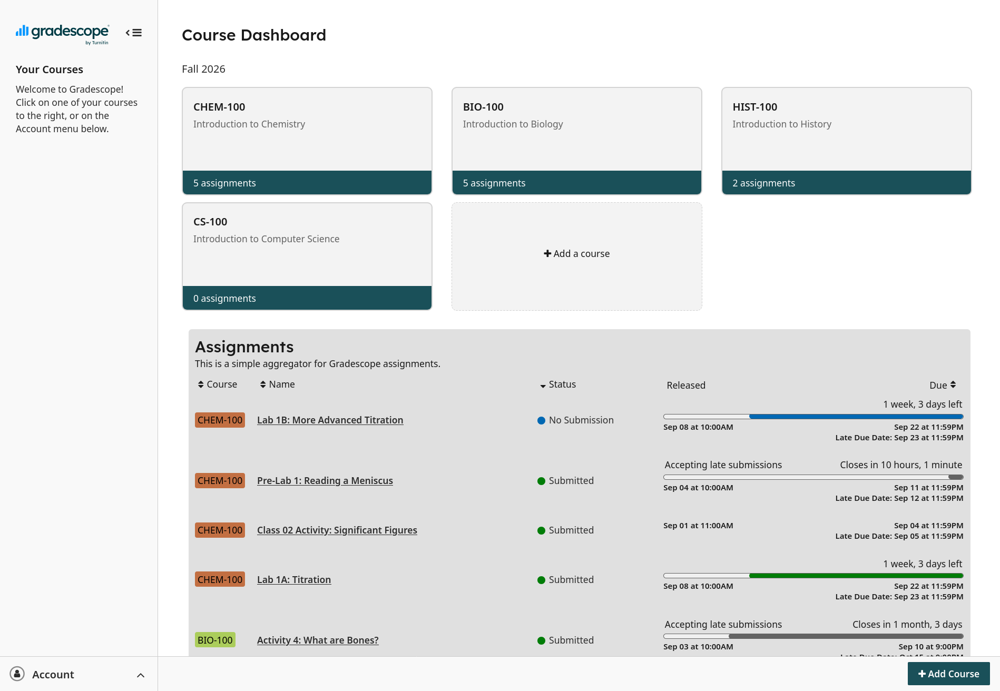

# Gradescope Assignment Overview

Brings Gradescope assignments from individual class pages onto a combined table on the general dashboard for an easier overview. Supports sorting by course, title, status, and due date.

This extension is not affiliated with Gradescope.



## Building

To reproduce the extension, install bun and run the following commands (or their npm equivalents, if you prefer) from the base directory:

```
bun install
bun run zip:firefox
```